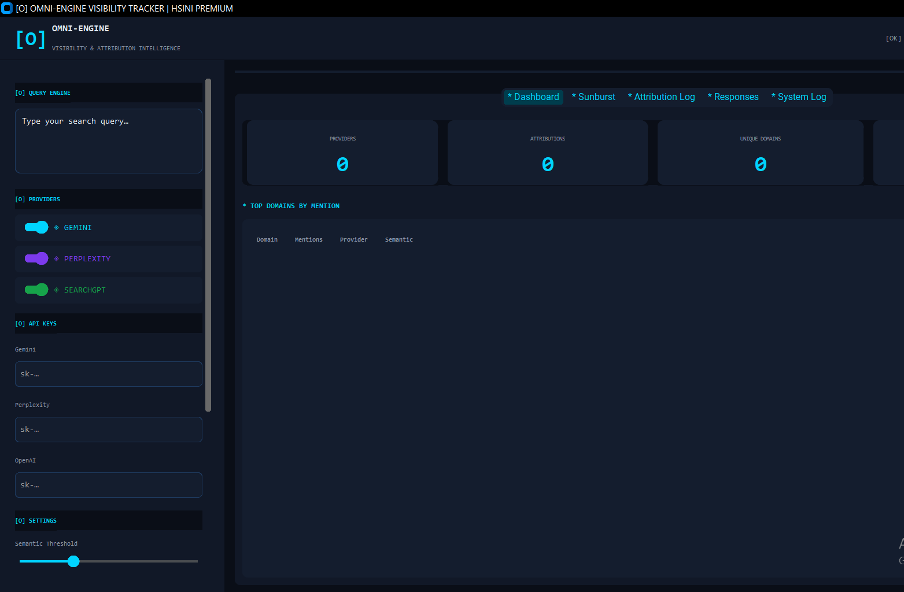

# Technical Documentation: Omni-Engine Visibility Tracker

## 1. Overview
The Omni-Engine Visibility Tracker is a specialized tool for **Generative Engine Optimization (GEO)**. It measures how often a brand or entity is mentioned and cited by AI Search engines, providing a "Visibility Score" based on semantic relevance and attribution density.

## 2. Core Modules

### 2.1 `core/engine.py`
- **AttributionExtractor:** Uses regex-based heuristic mapping to find URLs and metadata in raw text. It extracts:
    - **Domains:** Normalized source identification.
    - **Authors:** Detects "By [Name]" patterns.
    - **Titles:** Captures quoted or bracketed titles.
- **SemanticEngine:** Uses `SentenceTransformer` (all-MiniLM-L6-v2) to calculate the cosine similarity between the user's intent and the AI's response.
    - *Fallback:* If the model isn't downloaded, it uses a keyword-overlap jaccard similarity metric.

### 2.2 `core/providers.py`
- **ProviderEngine:** Orchestrates the multi-threaded querying.
    - **Gemini:** Connects to `google-generativeai`.
    - **Perplexity:** Connects via OpenAI-compatible SDK to `api.perplexity.ai`.
    - **SearchGPT:** Connects via OpenAI SDK using the `gpt-4o-search-preview` model.
- **Demo Mode:** If API keys are missing, the engine returns high-fidelity mock data to allow for UI testing and demonstration.

### 2.3 `core/exports.py`
- **JSON-LD:** Exports a `Dataset` schema following `schema.org` standards, making the report machine-readable.
- **PDF:** Uses `ReportLab` to build a professional multi-page document featuring KPI tables and detailed attribution logs.

## 3. GUI Design (Cyber-Pentagon)
The UI is built with `customtkinter` and follows a strict design palette:
- **Primary Background:** `#0a0e17` (Deep Space)
- **Primary Accent:** `#00d4ff` (Neon Cyan)
- **Secondary Accent:** `#7c3aed` (Purple)
- **Neutral Text:** `#e2e8f0` (Off-white)

### Tabs System:
1. **Dashboard:** High-level summary and "Top Domains" frequency table.
2. **Sunburst:** Interactive visualization showing the hierarchy of Providers -> Domains.
3. **Attribution Log:** A raw, sortable list of every link found.
4. **Responses:** Full-text view of the original LLM output.
5. **System Log:** Real-time console for debugging and status updates.

## 4. Advanced Usage

### Setting Thresholds
In the sidebar, you can adjust the **Semantic Threshold**. 
- Scores below this threshold indicate the AI is "hallucinating" or straying far from the specific query intent.
- Higher thresholds yield stricter visibility metrics.

### Exporting for SEO
The **JSON-LD export** is designed to be embedded in web pages or processed by data pipelines to prove "AI-Verified" authority for specific topics.

## 5. Troubleshooting

- **GUI Encoding Error:** If the program crashes on startup with a `UnicodeEncodeError`, ensure your terminal supports UTF-8. The program has been updated with ASCII-safe labels for maximum compatibility.
- **Missing Images:** If the sunburst doesn't show up, ensure `kaleido` is installed for static image export, or simply view the interactive HTML version opened in the browser.

---
**Developer:** HSINI MOHAMED
**Version:** 1.0.0
**Enterprise Standard:** Python 3.12+
