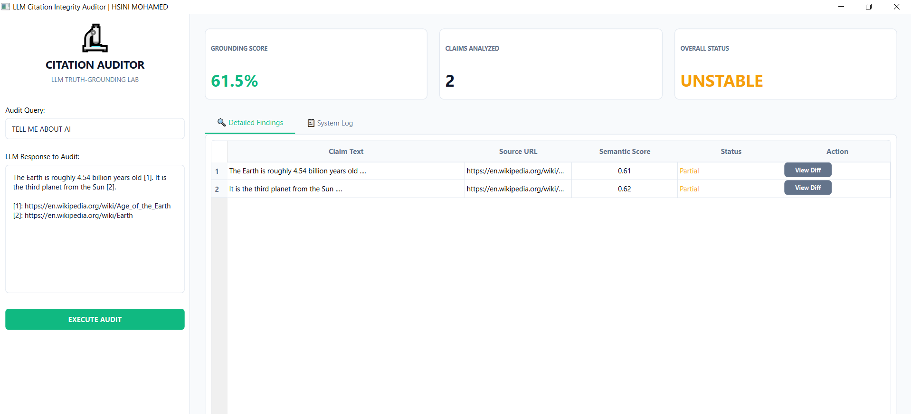

# HOW TO USE: LLM Citation Integrity Auditor



## 1. Setup
### Installation
```bash
pip install -r requirements.txt
```

## 2. Operation
1. **Launch the Auditor**:
   ```bash
   python main.py
   ```
2. **Auditing Workflow**:
   - **Input Response**: Paste the LLM output you wish to verify.
   - **Scrape Sources**: The tool will automatically identify and fetch citation URLs using LangChain and BeautifulSoup.
   - **Grounding Analysis**: Click `ANALYZE INTEGRITY` to run the cosine similarity check.
3. **Interpret Output**:
   - **Grounding Meter**: A 0-100 score indicating truth-grounding.
   - **Diff Viewer**: Highlighting discrepancies between LLM claims and source truth.

## 3. Advanced Features
- **Schema Injection**: Use the `INJECT SCHEMA` button to auto-generate 'Verified By' JSON-LD for your verified content.

---
**Developer:** HSINI MOHAMED
**Category:** GEO & AI-Search Orchestration
