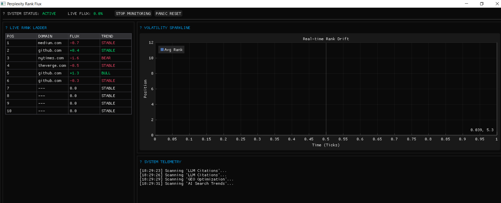

# HOW TO USE: Perplexity Rank Flux Monitor




## 1. Setup
### Prerequisites
- Python 3.12+
- Selenium Stealth
- Rotating Proxies (Optional but Recommended)

### Installation
```bash
pip install -r requirements.txt
```

## 2. Operation
1. **Initialize the Monitor**:
   ```bash
   python main.py
   ```
2. **Monitoring Setup**:
   - **Keyword List**: Upload or enter the keywords you want to track on Perplexity.ai.
   - **Frequency**: Set the polling interval for rank checks.
3. **Dashboard Interface**:
   - **Rank-Ladder**: Live view of source positions.
   - **Sparklines**: Visual trend of rank volatility over time.
4. **Alerts**:
   - **Panic Alert**: The system will trigger a desktop notification if your domain drops from the top results.

## 3. Database
All logs are stored in `rank_flux.db` (SQLite-WAL) for high-performance historical analysis.

---
**Developer:** HSINI MOHAMED
**Category:** GEO & AI-Search Orchestration
