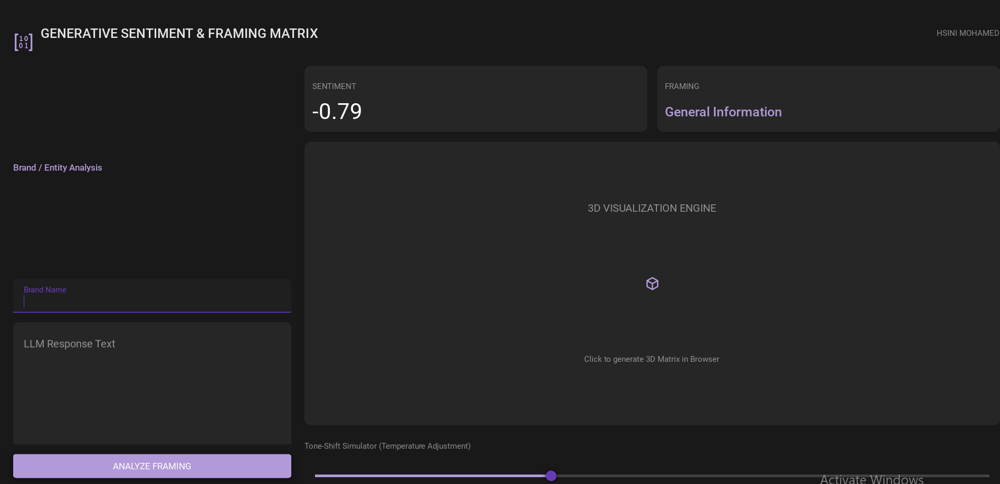

# 💠 Generative Sentiment & Framing Matrix



**Generative Sentiment & Framing Matrix** is an advanced NLP visualization tool designed to analyze how AI models "frame" specific brands and entities. Developed by **HSINI MOHAMED**, this application goes beyond simple sentiment scoring to identify underlying biases and categorical framing in LLM responses.

---

## 🚀 Quick Start

### 1. Installation
Requires Python 3.12+. Install the deep learning and visualization stack:

```bash
pip install -r requirements.txt
```

### 2. Launch the Matrix
Run the KivyMD application:

```bash
python main.py
```

---

## 🛠️ Features

- **Neumorphic Dark UI:** A sophisticated interface using Lavender and Charcoal tokens, optimized for modern visual workflows.
- **DistilBERT Intelligence:** Uses a fine-tuned DistilBERT transformer model for high-precision sentiment analysis.
- **Framing Bias Detection:** Identifies how the LLM categorizes a brand (e.g., "Premium Leader", "Budget Alternative", "Technical Authority").
- **3D Plotly Visualization:** Generates an interactive 3D scatter plot (Sentiment vs. Authority vs. Brand) to visualize competitive landscapes.
- **Tone-Shift Simulator:** Adjustable temperature slider to simulate how LLM responses and framing might vary under different sampling parameters.
- **JSON-LD Schema Integration:** Automates SEO-ready Review-Snippet generation for analyzed data.

---

## 📂 Project Structure

- `main.py`: The primary KivyMD application entry point.
- `core/`:
    - `classifier.py`: DistilBERT NLP wrapper and framing heuristic logic.
    - `matrix.py`: 3D Plotly visualization engine.
    - `models.py`: Data models and Neumorphic design tokens.
- `requirements.txt`: Project dependencies.

---

## 📖 How to Use

1. **Entity Setup:** Enter the "Brand Name" and paste the LLM's response into the text field.
2. **Analyze:** Click **ANALYZE FRAMING**. The system will process the text through the transformer model.
3. **Review Metrics:**
    *   **Sentiment:** Numeric score from -1.0 to +1.0.
    *   **Framing:** The qualitative category assigned by the NLP engine.
4. **Visualize:** Click the **3D VISUALIZATION ENGINE** icon to open the interactive matrix in your browser.
5. **Simulate:** Adjust the **Temperature** slider to see the theoretical impact on response variance.

---

## ⚖️ License
Developed by **HSINI MOHAMED**. Part of the 1,000 Python Scripts Enterprise Collection. Engineered for AI Sentiment Intelligence.
