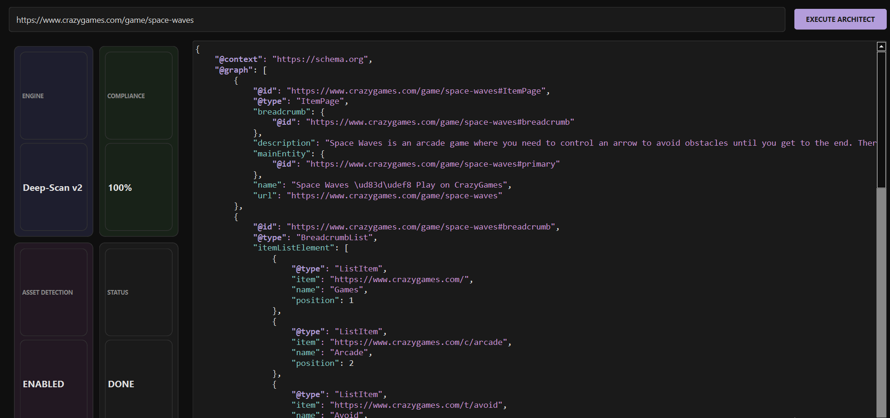

# HOW TO USE: Agentic GEO Schema Architect



## 1. Setup
### Installation
```bash
pip install -r requirements.txt
```

## 2. Operation
1. **Launch the Architect**:
   ```bash
   python main.py
   ```
2. **Schema Generation**:
   - **Entity Input**: Define the core entities (Brand, Product, Person).
   - **Optimize for GEO**: Select the 'Agentic' mode to prioritize citations in LLM training data proxies.
3. **Exporting**:
   - **JSON-LD**: One-click copy for website headers.
   - **Microdata**: Automated HTML injection templates.

## 3. UI Theme
The interface uses a **Modern Blueprint** theme with Architect Blue and Crisp White accents.

---
**Developer:** HSINI MOHAMED
**Category:** GEO & AI-Search Orchestration
