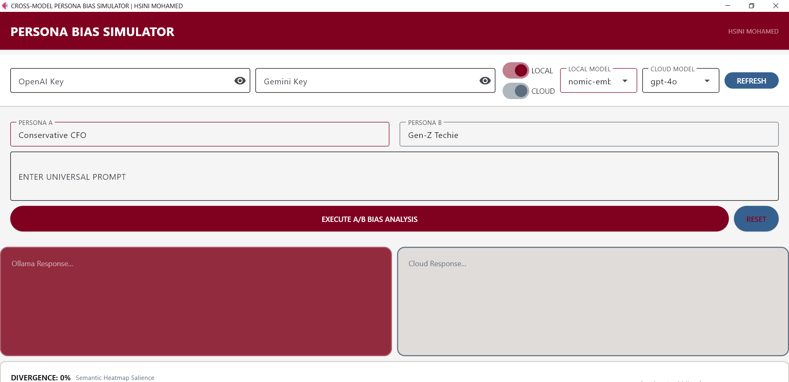

# Technical Documentation: Cross-Model Persona Bias Simulator

## 1. Overview
The Cross-Model Persona Bias Simulator is a benchmarking tool for evaluating "LLM Personalities." In the context of Generative Engine Optimization (GEO), understanding model bias is essential for crafting prompts that resonate with specific user segments while maintaining brand safety.

## 2. Technical Architecture

### 2.1 Flet UI (Flutter for Python)
The application leverages **Flet**, which renders a Flutter UI from Python code.
- **Layout:** A horizontal scrollable row (`ft.Row`) of vertical panels, allowing for N-way comparisons.
- **Theming:** A specialized "A/B Testing" palette using Burgundy (`#800020`) for the primary action areas and Warm Grey (`#B8B0A8`) for secondary information panels.

### 2.2 Multi-Model Engine (`core/engine.py`)
- **Parallelization:** Uses `asyncio.gather` to dispatch prompts concurrently. This minimizes total latency and provides a "live" dashboard experience.
- **Normalization:** Scopes and normalizes behavioral metrics across different API outputs to ensure a "fair" side-by-side comparison.

### 2.3 Bias Scoring Metrics
The simulator evaluates three primary vectors:
1. **Empathy:** Measures the degree of emotional resonance and validation in the response.
2. **Caution:** Evaluates the presence of disclaimers, safety warnings, and non-committal language.
3. **Directness:** Measures the conciseness and lack of conversational "fluff."

## 3. Data Export
The system provides a CSV export bridge. This allows researchers to aggregate hundreds of "Persona-Prompt" pairs and analyze the data in tools like Pandas or R to identify statistically significant model biases (e.g., "Model X is 20% more cautious when addressing Persona Y").

## 4. Dependencies
- **Flet:** The UI engine.
- **OpenAI/Anthropic/Google SDKs:** Required for real-world model interaction (API keys required via environment variables).

---
**Developer:** HSINI MOHAMED
**Version:** 1.0.0
**Project ID:** 6
