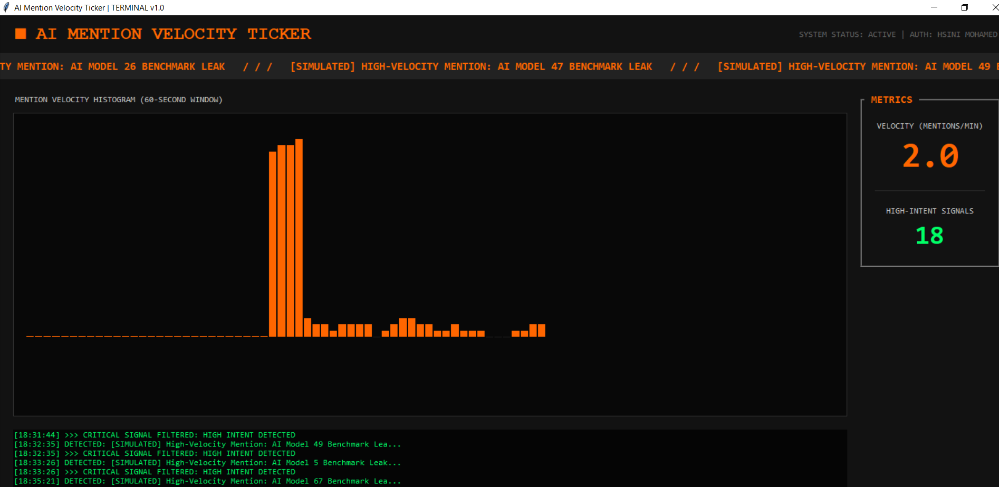

# Featured-Snippet Neural Optimizer




Built by **HSINI MOHAMED**

## Overview
The Featured-Snippet Neural Optimizer is an "Agency-Modern" desktop application designed to refine content for AI search engines (Gemini, Perplexity). It uses Atomic Paragraph Deconstruction to break down complex text into structured, snippet-friendly formats.

## Key Features
- **Atomic Deconstruction**: Real-time sentence-level analysis.
- **Before vs. After**: Side-by-side comparison of optimized content.
- **Dual Mode Rewriting**:
  - **Gemini**: Step-by-step actionable structure.
  - **Perplexity**: Concise, fact-dense blocks.
- **GEO Confidence Score**: Metrics based on readability, entity density, and fact count.
- **Semantic HTML5 Export**: One-click export to high-fidelity, SEO-ready HTML.

## Tech Stack
- **WxPython (Phoenix)**: Premium GUI Framework.
- **TextStat**: Readability and complexity metrics.
- **NLTK**: Natural Language Processing and Named Entity Recognition.

## Installation
```bash
pip install -r requirements.txt
```

## Usage
1. Run `python main.py`.
2. Paste your content in the 'Source' window.
3. Select 'Gemini' or 'Perplexity' mode.
4. Click 'EXECUTE NEURAL OPTIMIZATION'.
5. View the GEO Score and Export to HTML.
