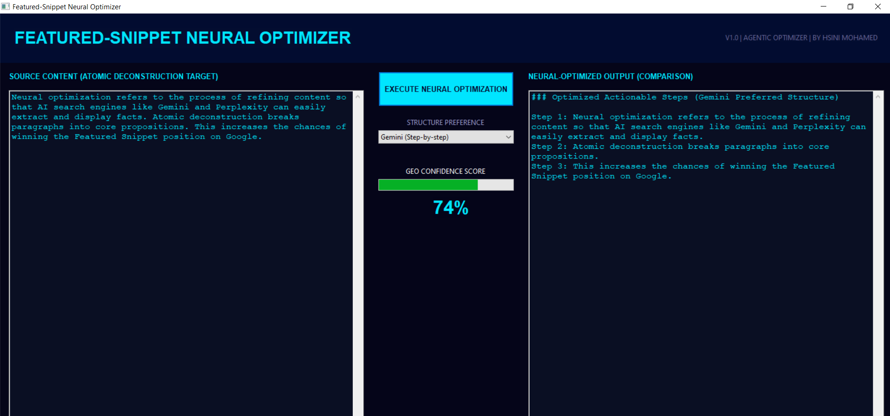

# Entity Saliency & Relationship Mapper




Built by **HSINI MOHAMED**

## Overview
The Entity Saliency Mapper is an experimental 3D Knowledge Graph visualization tool. It uses Named Entity Recognition (NER) and the PageRank algorithm to map brand relationships and calculate the "Saliency" of individual entities (CEOs, Products, Companies) within the neural search ecosystem.

## Key Features
- **3D Neural-Network Graph**: Interactive visualization using PyVista.
- **Saliency Calculation**: Uses the PageRank algorithm to determine entity importance.
- **Semantic Collapse Simulation**: Click on a node to remove it and observe how the knowledge graph's connectivity and saliency distributions collapse.
- **Auto-Wiki Article**: Generates an authority article based on the graph's structure.

## Tech Stack
- **PyVista**: 3D Visualization and mesh interaction.
- **NetworkX**: Graph theory and PageRank logic.
- **NLTK/Regex**: Entity extraction and relationship mapping.

## Installation
```bash
pip install -r requirements.txt
```

## Usage
1. Run `python main.py`.
2. Interact with the 3D graph (rotate, zoom).
3. **Click a node** to simulate its removal and see the impact on the semantic network.
4. Check `authority_article.txt` for the generated semantic profile.
