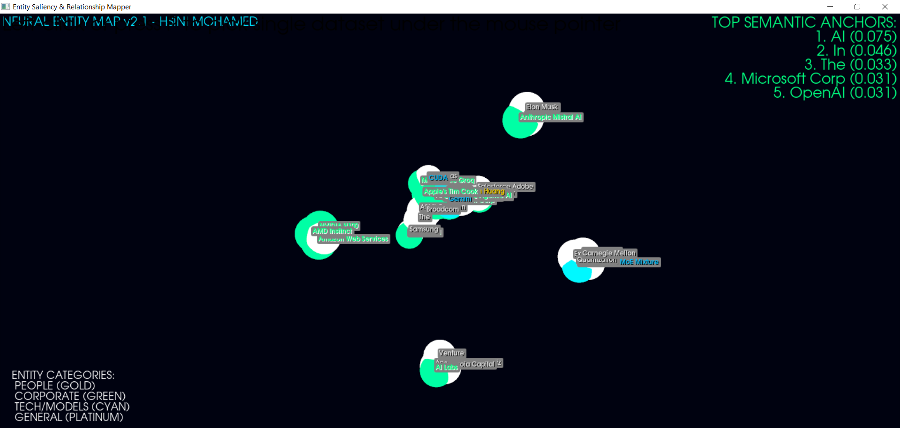

# AI Mention Velocity Ticker

Built by **HSINI MOHAMED**

## Overview
An industrial-grade financial-terminal ticker designed for real-time monitoring of AI brand mentions. This tool helps GEO (Generative Engine Optimization) experts track mention velocity and filter for high-intent signals that influence LLM RAG systems.

## Features
- **Scrolling Marquee**: Custom high-speed Tkinter Canvas ticker.
- **Real-time Histogram**: Dynamic visualization of mention volume.
- **Velocity Calculation**: MPM (Mentions Per Minute) tracking.
- **High-Intent Filtering**: AI-driven logic to identify critical mentions.
- **Financial-Terminal Theme**: Safety Orange and Graphite aesthetic.

## Documentation
- [DOCUMENTATION.md](./DOCUMENTATION.md)
- [HOW_TO_USE.md](./HOW_TO_USE.md)

## Tech Stack
- Tkinter (Custom Canvas)
- Feedparser (RSS Aggregation)
- Websockets (Streaming Architecture)
- G-Tag Simulation
