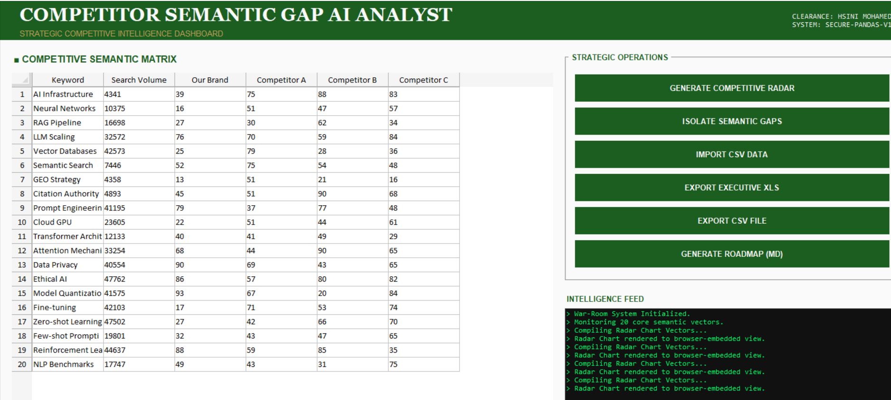

# HOW TO USE: Competitor Semantic Gap Analyst



## Setup
1. **Environment**: Python 3.10+ recommended.
2. **Install Libraries**:
   ```bash
   pip install -r requirements.txt
   ```

## Operation
1. **Run the Dashboard**:
   ```bash
   python main.py
   ```
2. **Analysis Workflow**:
   - **Step 1: View Matrix**: Inspect the `Competitive Semantic Matrix` in the main data grid.
   - **Step 2: Radar Visuals**: Click `GENERATE COMPETITIVE RADAR` to open an interactive 3D/Polar chart in your browser.
   - **Step 3: Isolate Gaps**: Click `ISOLATE SEMANTIC GAPS` to find areas where your competitors are winning citations.
   - **Step 4: Generate Strategy**: Use `GENERATE ROADMAP (MD)` to create a tactical content brief to counteract competitor dominance.
   - **Step 5: Export**: Click `EXPORT EXECUTIVE XLS` for a professional report to share with leadership.

## Customization
You can update the `self.keywords` list in `main.py` within the `GapAnalystEngine` class to tailor the analysis to your specific niche.

## Metadata
- **Developer**: HSINI MOHAMED
- **Standard**: GEO-Ready Strategic AI Intelligence
