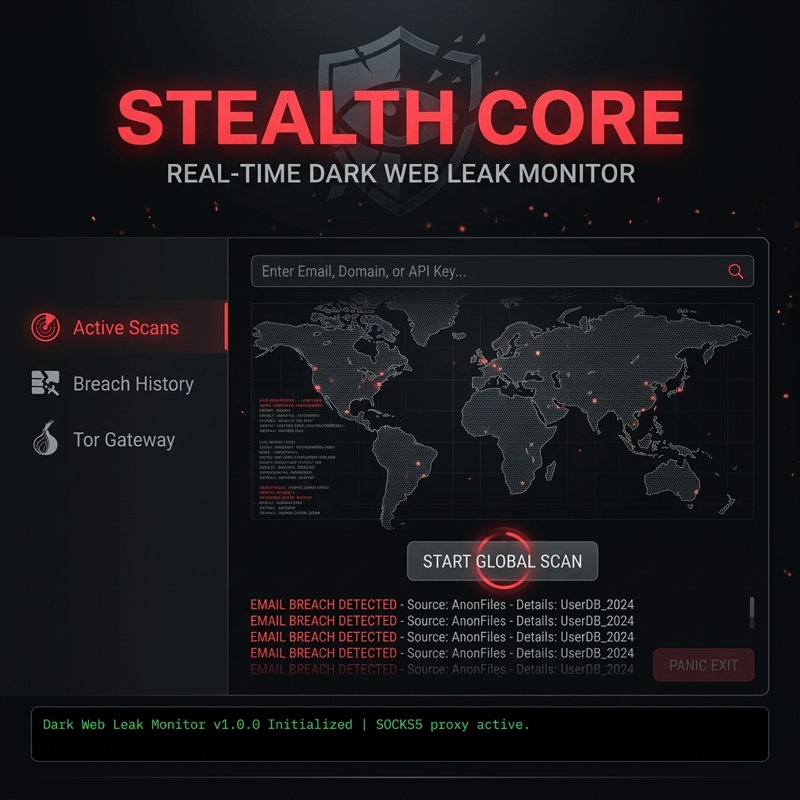

# Real-time Dark Web Leak Monitor

Developed by **HSINI MOHAMED**, this enterprise-grade security tool monitors Onion-based data repositories for sensitive information leaks (Emails, API Keys, Domain mentions) using the Tor network.

## Features
- **Tor Integration**: Automated circuit management via Stem.
- **Encrypted Storage**: AES-256 local database for breach logs.
- **Tactical UI**: Ghost-Grey and Tactical Red stealth theme.
- **Panic Exit**: Instant process termination and cache clearing.
- **Async Scanning**: Non-blocking deep-web querying.

## Tech Stack
- **UI**: CustomTkinter
- **Networking**: Stem + PySocks
- **Security**: SQLite-Cipher
- **Language**: Python 3.12+
