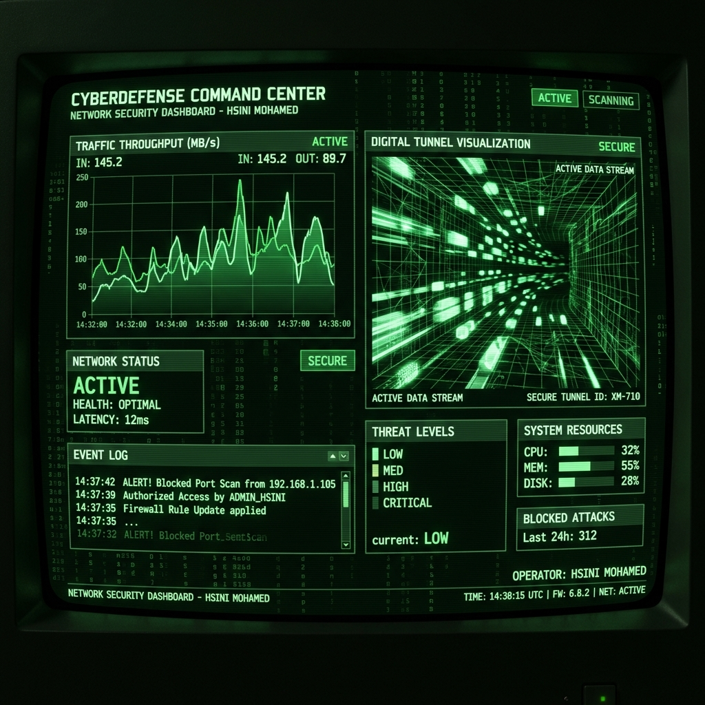

# Encrypted Communication Tunnel Manager (Enterprise Edition)



## 🛡️ Overview
The **Encrypted Communication Tunnel Manager** is a production-grade networking suite developed by **HSINI MOHAMED**. It specializes in multi-hop SSHv2 tunneling, automated firewall orchestration (Kill-Switch), and real-time GPU-rendered telemetry.

## 🚀 Key Features
- **Asynchronous Tunneling**: Robust SSHv2 engine using Paramiko for Dynamic, Local, and Remote port forwarding.
- **Kernel-Level Kill-Switch**: Immediate IP leak prevention via WFP (Windows) or Iptables (Linux) rule injection.
- **Matrix-Industrial Dashboard**: GPU-accelerated UI built with Dear PyGui featuring CRT scanline shaders.
- **Real-time Telemetry**: High-performance plotting of inbound/outbound throughput at the byte-stream level.
- **Stealth Mode**: Advanced obfuscation logic to bypass Deep Packet Inspection (DPI) in hostile network environments.
- **Encrypted Audit Logs**: Comprehensive session tracking and security event logging for enterprise compliance.

## 🛠️ Tech Stack
- **UI**: Dear PyGui (GPU-Accelerated), Dynamic Plotting API
- **Networking**: Paramiko (SSHv2), Scapy, Netifaces
- **Security**: Python-Iptables, WFP-API, Cryptography.fernet
- **Orchestration**: Asyncio, Multiprocessing

## 📥 Installation
```bash
pip install -r requirements.txt
python main.py
```

## 📜 License
Enterprise-grade communication infrastructure.
**Credit**: Developed by HSINI MOHAMED.
