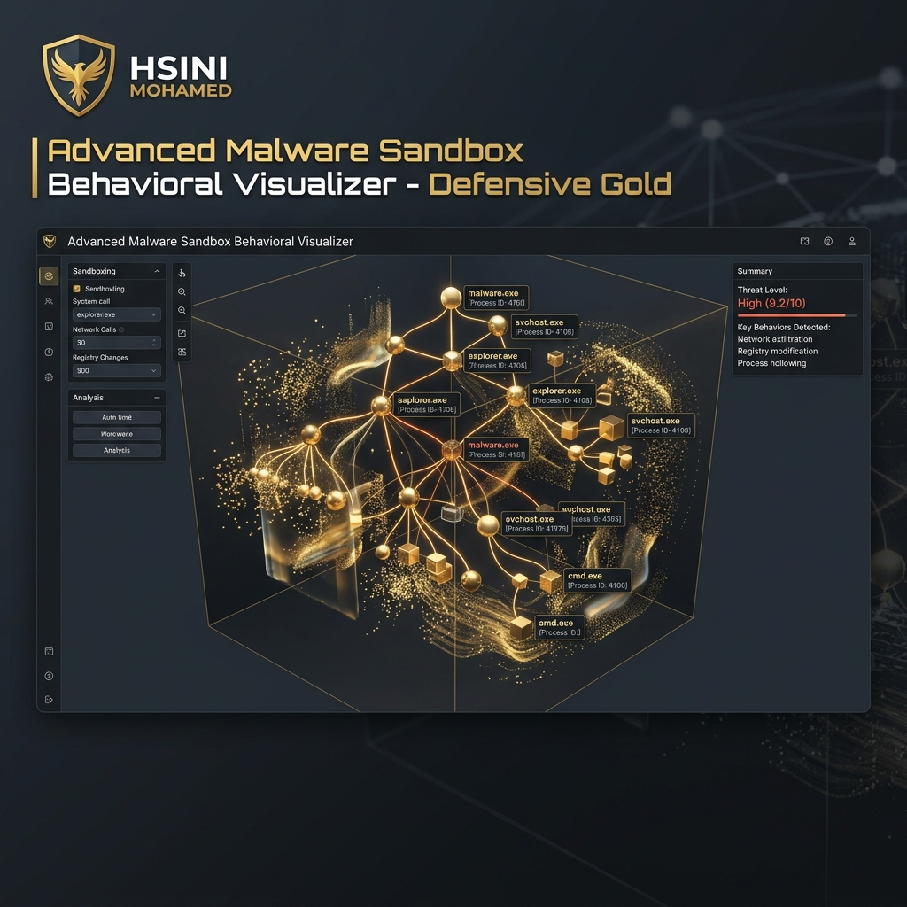

# Malware Sandbox Behavior Visualizer (Enterprise Edition)



## 🛡️ Overview
The **Malware Sandbox Behavior Visualizer** is an advanced forensic platform developed by **HSINI MOHAMED**. It transforms complex, flat malware logs into an interactive 3D spatial representation, allowing security analysts to visualize the growth and impact of a process tree in real-time.

## 🚀 Key Features
- **3D Spatial Mapping**: Volumetric rendering of malware behavior using PyVista/VTK. Process trees are modeled as growing 3D structures.
- **Event-Stream Forensics**: Real-time instruction tracing and API hooking integrated with a 3D growth model.
- **Heuristic Risk Engine**: Automated scoring of suspicious behaviors mapped directly to the MITRE ATT&CK matrix.
- **Environment Safety Gate**: Built-in logic to ensure execution only within hardened, isolated virtualized environments (Libvirt/Cuckoo).
- **Time-Travel Replay**: Forensic timeline with a frame-by-frame playback slider to watch the infection progress.
- **Kill-Switch Guard**: Instant VM termination logic if lateral movement or unauthorized network access is detected.

## 🛠️ Tech Stack
- **UI/Viz**: PyVista (3D Rendering), PyQt6 (Interface Overlay), QSS
- **Analysis**: WinAppDbg (Instruction Tracing), Capstone (Disassembly), YARA (Pattern Matching)
- **Engine**: Cuckoo-API / Libvirt, Polars (High-speed log processing)
- **Theme**: Defensive-Gold (Premium Tactical Aesthetic)

## 📥 Installation
```bash
pip install -r requirements.txt
python main.py
```

## 📜 License
Advanced malware research infrastructure.
**Credit**: Developed by HSINI MOHAMED.
