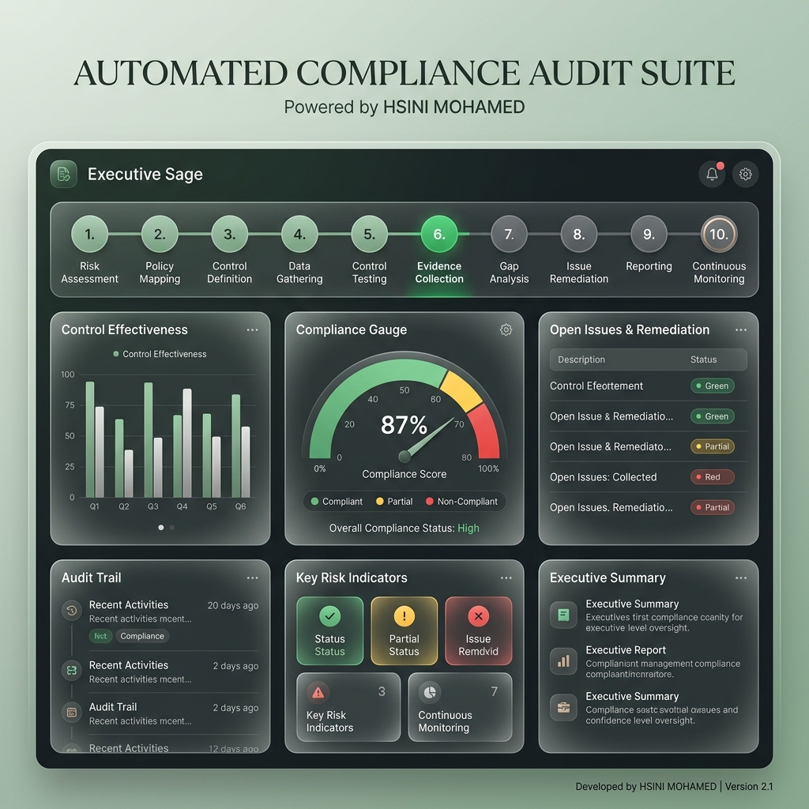

# Automated Compliance Audit Suite (Enterprise GRC Edition)



## 🏛️ Overview
The **Automated Compliance Audit Suite** is a high-fidelity GRC (Governance, Risk, and Compliance) platform developed by **HSINI MOHAMED**. Designed for enterprise security teams, it automates the validation of technical and operational controls against global standards like ISO 27001 and SOC2.

## 🚀 Key Features
- **Framework-Driven Audits**: Dynamic loading of compliance controls from YAML definitions (ISO 27001, SOC2, HIPAA).
- **Asynchronous System Scanner**: Automatic verification of technical controls via registry checks, service status monitoring, and log parsing.
- **Executive Sage Dashboard**: Modern, high-performance UI built with CustomTkinter featuring an interactive 10-step progress stepper.
- **Real-Time Posture Gauge**: Visual compliance scoring using integrated Matplotlib gauges.
- **Gap Analysis Matrix**: Granular view of control implementation status with automated remediation roadmap generation.
- **Professional Reporting**: Executive-ready PDF and Docx report generation using ReportLab and Python-Docx.
- **Evidence Management**: Secure logic for associating policy documents and technical evidence with specific controls.

## 🛠️ Tech Stack
- **UI**: CustomTkinter, Matplotlib, QSS-inspired styling
- **Engine**: PyYAML, PSUtil, WinReg, Pandas
- **Reporting**: ReportLab, Python-Docx
- **Persistence**: SQLite3

## 📥 Installation
```bash
pip install -r requirements.txt
python main.py
```

## 📜 License
Enterprise-grade compliance infrastructure.
**Credit**: Developed by HSINI MOHAMED.
