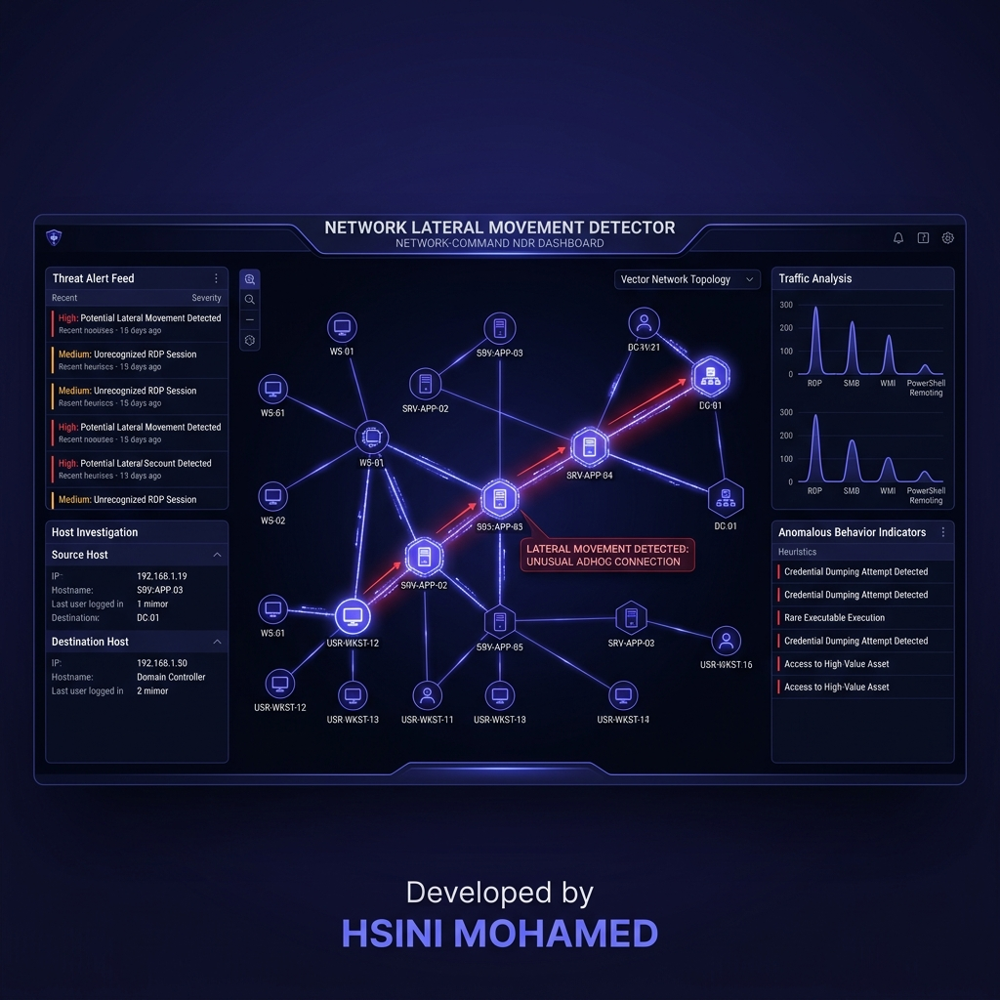

# Network Lateral Movement Detector (Enterprise NDR Edition)



## 🌐 Overview
The **Network Lateral Movement Detector** is a high-performance NDR (Network Detection and Response) platform developed by **HSINI MOHAMED**. It specialized in identifying the subtle patterns of internal network compromise, such as ARP spoofing, credential brute-forcing, and unauthorized lateral traversals across network zones.

## 🚀 Key Features
- **Asynchronous Packet-Pipeline (APPA)**: High-fidelity packet sniffing using Scapy and Npcap with zero-loss processing.
- **Graph-Based Topology Analysis**: Uses NetworkX to map assets and identify anomalies in connectivity patterns.
- **Electric Indigo Dashboard**: Modern WxPython interface with live-updating SVG network topology maps.
- **Pulsing Behavioral Alerts**: Assets pulse with indigo glows during normal operation and transition to animated crimson pulses when threats are detected.
- **Automated Defense Orchestration**: Generates and applies firewall rules (WFP/Iptables) to isolate compromised nodes automatically.
- **Pcap Incident Playback**: Reload historical PCAP files to replay and analyze attack sequences on the visual graph.
- **MITRE ATT&CK Mapping**: Every detected movement is mapped to lateral movement techniques (e.g., T1021 Remote Services).

## 🛠️ Tech Stack
- **UI**: WxPython, CairoSVG, Custom Vector Rendering
- **Sniffer**: Scapy, Npcap, Asyncio
- **Analysis**: NetworkX, Pandas, NumPy
- **Orchestration**: PyWFP, Iptables-Python
- **Theme**: Network-Command (Indigo/Obsidian)

## 📥 Installation
```bash
pip install -r requirements.txt
python main.py
```

## 📜 License
Enterprise NDR infrastructure.
**Credit**: Developed by HSINI MOHAMED.
